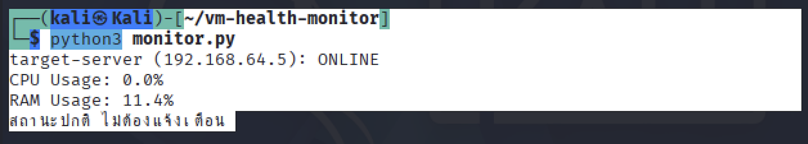
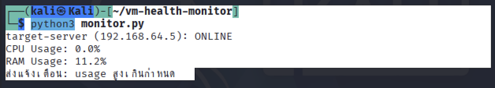
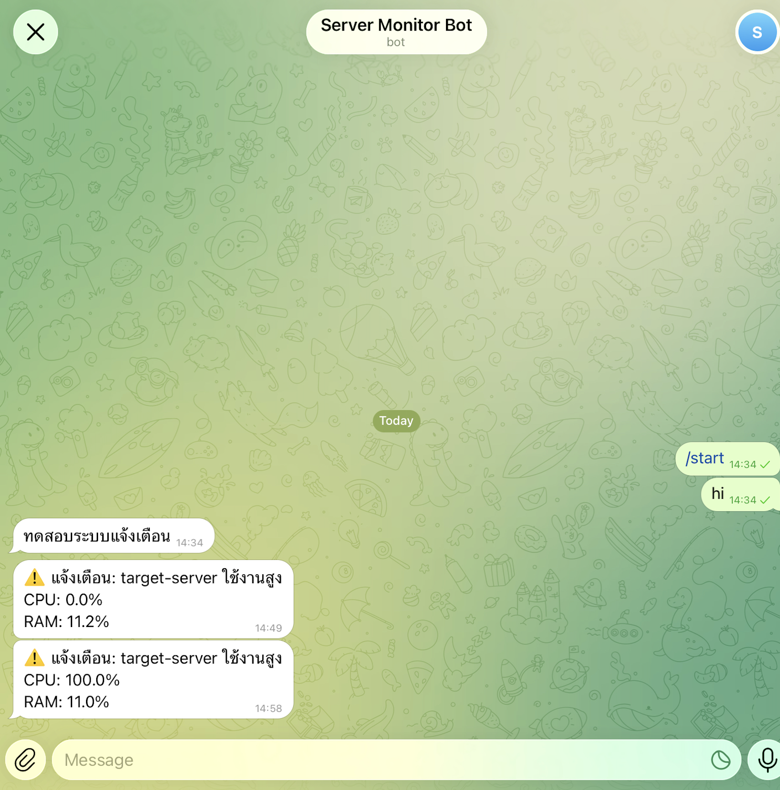

# VM Health Monitor

A real-time server and network health monitoring system with automated Telegram alerts. Built as a hands-on project to practice Linux System Administration, Network Monitoring, Automation, and Database skills relevant to a Network/System Engineer role.

## Overview

The system runs on a home lab that simulates a real server monitoring scenario, using two virtual machines working together:

- **Kali Linux** — the "monitor" machine that runs the script, checks server status, and sends alerts
- **Ubuntu Server** — the "target" machine, simulating a real production server being watched

```
[Kali Linux]  --ping + SSH-->  [Ubuntu Server]
     |                               |
     v                               v
 SQLite Database              psutil (CPU/RAM)
     |
     v
 Telegram Bot Alert
```

Both machines run on an isolated virtual network (Host Only / Shared Network), completely separated from any external network, to keep testing safe and self-contained.

## Features

- **Ping Check** — verifies the target server's connectivity status in real time
- **Resource Monitoring** — retrieves live CPU and RAM usage from the target server over SSH using `psutil`
- **Database Logging** — stores every check into a SQLite database for historical tracking
- **Automated Alerts** — sends a Telegram message instantly when:
  - the target server goes offline / becomes unreachable
  - CPU or RAM usage exceeds a defined threshold

## Tech Stack

| Category | Tool |
|---|---|
| Language | Python 3 |
| Server Connection | `paramiko` (SSH) |
| System Metrics | `psutil` |
| Database | SQLite3 |
| Alerting | Telegram Bot API (`requests`) |
| Operating Systems | Kali Linux (monitor) / Ubuntu Server (target) |
| Virtualization | UTM (QEMU) |

## Project Structure

```
vm-health-monitor/
├── monitor.py            # Main monitoring script
├── screenshots/           # Screenshots of the system in action
│   ├── 01-normal-status.png
│   ├── 02-alert-triggered.png
│   ├── 03-telegram-alert.jpeg
│   └── 04-database-log.png
└── README.md
```

## How It Works

1. The script first pings the target server to check basic connectivity.
2. If the server is online, it connects via SSH using `paramiko` and runs a command to fetch live CPU and RAM usage with `psutil`.
3. Every result is logged into a SQLite database with a timestamp.
4. If the server is offline, or if CPU/RAM usage exceeds the configured threshold (default: 80%), an alert is sent immediately via a Telegram bot.

## Example Output

### Normal status — no alert needed

```
target-server (192.168.x.x): ONLINE
CPU Usage: 0.0%
RAM Usage: 11.4%
Status normal, no alert needed
```



### Abnormal status — alert triggered

Tested by simulating high CPU load on the target server:

```
target-server (192.168.x.x): ONLINE
CPU Usage: 100.0%
RAM Usage: 11.0%
Alert sent: usage exceeded threshold
```



### Telegram alert received

The bot sends a real-time notification straight to Telegram as soon as the threshold is crossed:



### Logged history in the database

Every check — normal or abnormal — is stored in SQLite for later review:


## Setup and Usage

### 1. Install dependencies
```bash
pip install psutil paramiko requests --break-system-packages
```

### 2. Configure the variables in `monitor.py`
```python
TARGET_IP = "192.168.x.x"       # IP address of the target server
SSH_USER = "your_username"
SSH_PASSWORD = "your_password"
TELEGRAM_TOKEN = "your_telegram_bot_token"
TELEGRAM_CHAT_ID = "your_telegram_chat_id"
```

### 3. Run the script
```bash
python3 monitor.py
```

> **Security note:** This version uses placeholders for all sensitive values (passwords, tokens). Replace them with your own before running, and never commit real credentials to a public repository.

## Troubleshooting Notes

- **CPU usage always read as 0.0%:** Initially used `top -bn1` over SSH, which only takes a single snapshot and doesn't reflect real usage accurately. Switched to running `psutil.cpu_percent(interval=1)` directly on the target machine via SSH, which measures usage over a real time interval and gives far more accurate readings.
- **Telegram bot failed with `chat not found`:** Telegram requires the user to initiate the conversation with a bot (by pressing Start) before the bot is allowed to send messages back — a built-in anti-spam measure of the platform.
- **Network isolation during testing:** Switched the VM network mode between Shared Network and Host Only several times during development, to make sure any network-related testing stayed fully isolated from external networks and never affected other devices.

## Future Improvements

- Dynamic baseline anomaly detection (compare current usage against a rolling historical average instead of a fixed threshold)
- Support monitoring multiple servers simultaneously
- Build a web dashboard to visualize the SQLite data in real time

## Author

**Thanita Khammoonin**

This project was built to practice skills relevant to a Network Engineer role — specifically Linux Server Administration, Computer Networking, Monitoring, Automation Scripting, and Database Management.
